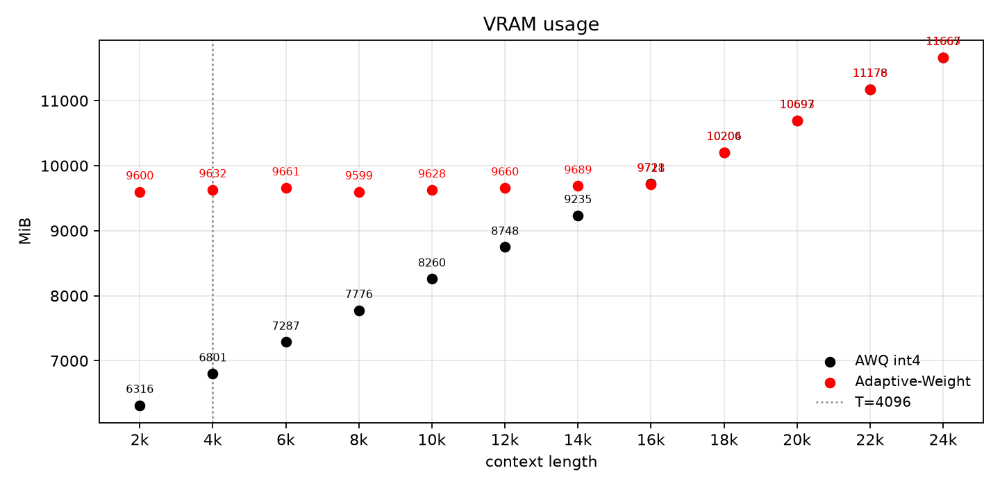
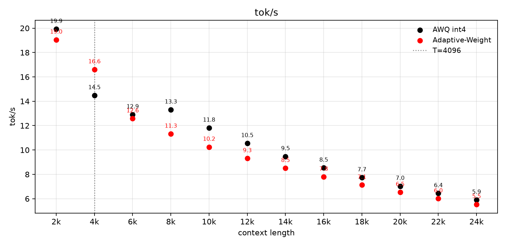
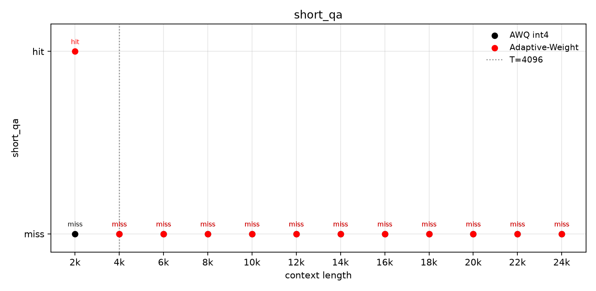
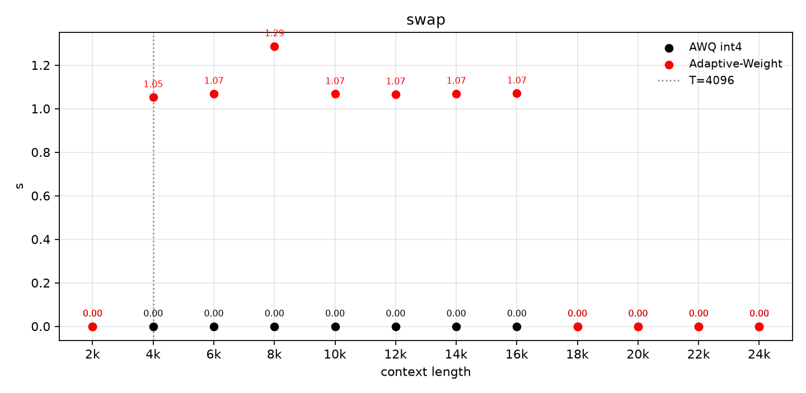

# Adaptive-Weight

Progressive weight precision for long-context LLM serving: keep **int8** while VRAM allows, then demote layers to **int4** under a soft memory hold — without a cold W4 reload.

Short prompts stay closer to W8 quality. As context grows, occupancy pressure demotes layers in rank order until the model matches fixed AWQ int4 once demotion is exhausted.

## Idea

| | Adaptive-Weight | Fixed AWQ int4 |
| --- | --- | --- |
| Load | Full W8, demote only under pressure | Full W4 from the start |
| VRAM @ 2k–16k | **~9.4–9.5 GiB flat** (hold ≈ W8 footprint + 0.5 GiB) | Grows with KV (~6.2 → ~9.5 GiB) |
| Past demote exhaust (~16k) | Same as W4+KV (~10–11.4 GiB @ 18k–24k) | Same |
| Early `short_qa` @ 2k | hit | miss |
| IFStruct `pass_rate` (n=100) | **60%** | **58%** |

Demotion fires when projected occupancy exceeds a soft target:

\[
\text{projected} = \frac{\texttt{alloc\_mib} + L \cdot \texttt{kv\_mib\_per\_tok}}{1024},\qquad
\text{target} = \texttt{W8\_alloc} + \texttt{hold\_headroom\_gib}
\]

When \(\text{projected} > \text{target}\), the controller demotes \(K\) layers where

\[
K = \mathrm{clamp}\!\left(\left\lceil\frac{(\text{projected}-\text{target})\cdot 1024}{\texttt{save\_mean\_mib}}\right\rceil,\; K_{\min},\; K_{\max}\right)
\]

Layer order and per-layer W8→W4 savings come from an offline rank (`layer_rank.json`). KV quantization is off in the numbers below.

Stack: HuggingFace + Marlin packed GEMM; model **Qwen3-8B**.

## Soft-hold constants (retune per model / device)

These are **not** universal. Re-measure when changing model size, KV layout, batch, or GPU memory class.

| Knob | Role | How to set |
| --- | --- | --- |
| `kv_mib_per_tok` | MiB of KV (+activation slack) per context token in the projection | Fit from a short fixed-W4 or Adaptive session: \(\Delta\texttt{alloc\_mib}/\Delta L\). Default here ≈ **0.23** for Qwen3-8B, bs=1. |
| `hold_headroom_gib` | Soft ceiling above cold W8 alloc | Start near **0.35–0.75**; **0.50** holds ≈ W8+0.5 GiB in this run. Too tight → early demote; too loose → OOM before fire. |
| `occ_k_min` / `occ_k_max` | Layers demoted per fire | Small steps (e.g. **2–6**) smooth the hold; larger \(K\) dumps VRAM faster with bigger stalls. |
| `save_mean_mib` / `save_per_layer_mib` | Denominator for \(K\) | From `build_awq_layer_rank.py` (W8 vs W4 shard nbytes). Rebuild after any new W8/W4 checkpoint. |
| `demote_order` | Which layers go first | Same rank build: low W4 reconstruction error vs BF16 → demote earlier. Always rebuild for a new model. |
| `budget_gib` | Hard envelope (2-wave / logging) | Match usable device memory; soft path primarily uses `target` above. |

Typical retune loop:

1. Build W8 / W4 AWQ (and BF16 for rank) for the target model.
2. `build_awq_layer_rank.py` → fresh `layer_rank.json`.
3. Measure `kv_mib_per_tok` on that device (or set `0` if KV is pre-reserved).
4. Pick `hold_headroom_gib` so Adaptive VRAM stays flat near W8+headroom until demote exhaust, then tracks W4+KV.
5. Sweep `occ_k_*` if stalls or overshoot are too large.

CLI flags live on `hf_mixed_demote.py` (`--kv-mib-per-tok`, `--hold-headroom-gib`, `--occ-k-min`, `--occ-k-max`, `--layer-rank`, `--budget-gib`).

## Results (L-sweep)

Context length checkpoints: **2k…24k** in steps of 2k. Soft hold: `kv_mib_per_tok≈0.23`, `hold_headroom_gib=0.50`.

### VRAM



Adaptive-Weight stays under **~10 GiB through 16k**; fixed int4 climbs with context.

### Throughput



Same Marlin path; Adaptive-Weight stays in the same ballpark as fixed int4 (small gap once mixed layers appear).

### short_qa



### Demote stall (`swap_s`)



Live W8→W4 layer morph costs ~1.0–1.3 s per demotion step while layers remain W8; zero after the model is fully W4.

### Headline numbers

| L | Adaptive tok/s | AWQ int4 tok/s | Adaptive VRAM (MiB) | AWQ int4 VRAM (MiB) | Adaptive short_qa | AWQ short_qa | swap_s | W8 linears left |
| ---: | ---: | ---: | ---: | ---: | :---: | :---: | ---: | ---: |
| 2k | 19.0 | 19.9 | 9600 | 6316 | ✓ | ✗ | 0 | 252 |
| 4k | 16.6 | 14.5 | 9632 | 6801 | ✗ | ✗ | 1.05 | 217 |
| 8k | 11.3 | 13.3 | 9599 | 7776 | ✗ | ✗ | 1.29 | 140 |
| 12k | 9.3 | 10.5 | 9660 | 8748 | ✗ | ✗ | 1.07 | 70 |
| 16k | 7.8 | 8.5 | 9718 | 9721 | ✗ | ✗ | 1.07 | 0 |
| 18k | 7.1 | 7.7 | 10204 | 10206 | ✗ | ✗ | 0 | 0 |
| 24k | 5.5 | 5.9 | 11665 | 11667 | ✗ | ✗ | 0 | 0 |

Plots: `docs/figs/20260806T052437Z/`.

### Accuracy (IFStruct)

Structured-output `pass_rate` via `qwen_ifstruct_eval.validate_response`:

| Policy | n | pass_rate |
| --- | ---: | ---: |
| Adaptive-Weight (W8 start) | 100 | **0.60** (60/100) |
| AWQ int4 | 100 | **0.58** (58/100) |

## Reproduce

```bash
# offline demote order (after W8/W4/BF16 checkpoints exist)
python3 -u adaptive_weight/build_awq_layer_rank.py \
  --w4-dir quantized/Qwen3-8B-W4A16-AWQ \
  --w8-dir quantized_local/Qwen3-8B-W8A16-AWQ \
  --bf16-dir quantized/Qwen3-8B-BF16 \
  --out adaptive_weight/results/layer_rank.json

# locked clocks → L-sweep → four scatters
./adaptive_weight/run_beat_bench.sh \
  --out-dir results/$(date -u +%Y%m%dT%H%M%SZ)

# plot only
./adaptive_weight/run_beat_bench.sh --plot-only --run-dir results/<stamp>
```

IFStruct:

```bash
python3 -u adaptive_weight/hf_mixed_demote.py --mode ifstruct \
  --out-dir ifstruct_results/<stamp> \
  --dataset quantized/ifstruct_sample_100.jsonl \
  --ifstruct-policies "Adaptive-Weight,AWQ int4"
```

## Status

- Working path: HF + Marlin mixed demote (numbers above).
- Open: mixed-precision hot-swap in stock vLLM; HF Adaptive-Weight is the current demo.
- Edge / unified-memory targets use the same soft-hold idea; kernel support still limits throughput there.

Code entry points: `adaptive_weight/hf_mixed_demote.py`, `occupancy_ctrl.py`, `inplace_w_replace.py`, `run_beat_bench.sh`. Flags and package notes: [`adaptive_weight/README.md`](adaptive_weight/README.md).
